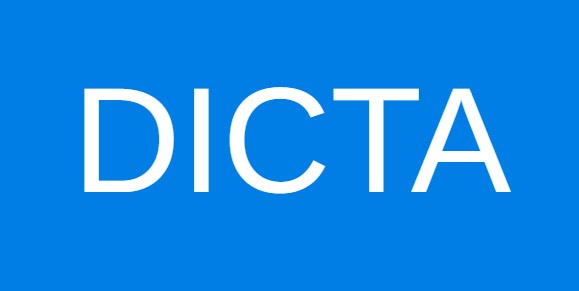

<!-- PROJECT SHIELDS -->
<!--
*** I'm using markdown "reference style" links for readability.
*** Reference links are enclosed in brackets [ ] instead of parentheses ( ).
*** See the bottom of this document for the declaration of the reference variables
*** for contributors-url, forks-url, etc. This is an optional, concise syntax you may use.
*** https://www.markdownguide.org/basic-syntax/#reference-style-links
-->
![Downloads][Github-downloads]
[![Contributors][contributors-shield]][contributors-url]
[![Forks][forks-shield]][forks-url]
[![Stargazers][stars-shield]][stars-url]
[![Issues][issues-shield]][issues-url]
[![GPL-3.0 License][license-shield]][license-url]


<div dir="rtl">

<!-- PROJECT LOGO -->
<br />
<div align="center">
  <a href="https://github.com/otzaria/otzaria">
    
  </a>

  <h3 align="center">אוצריא</h3>

  <p align="center">
    הנגשת הספרייה היהודית לכל אחד, על ידי יצירת אפליקציה עם ממשק וחווית משתמש מודרניים שיכולה לרוץ על כל מכשיר
    <br />
    <a href="https://www.otzaria.org/"><strong>לאתר שלנו »</strong></a>
    <br />
    <br/>  
    <a href="https://github.com/otzaria/otzaria/issues/new?labels=bug&template=bug-report---.md">דיווח על באג</a>
    ·
    <a href="https://github.com/otzaria/otzaria/issues/new?labels=enhancement&template=feature-request---.md">בקשת תכונה</a>
    ·
    <a href="https://github.com/otzaria/otzaria/wiki">מדריך למשתמש</a>
  </p>
</div>


<!-- TABLE OF CONTENTS -->
<details>
  <summary>תוכן עניינים</summary>
  <ol>
    <li>
      <a href="#about-the-project">אודות הפרויקט</a>
      <ul>
        <li><a href="#built-with">נבנה באמצעות</a></li>
      </ul>
    </li>
    <li>
      <a href="#getting-started">תחילת העבודה</a>
      <ul>
        <li><a href="#prerequisites">דרישות מקדימות</a></li>
        <li><a href="#installation">התקנה</a></li>
      </ul>
    </li>
    <li><a href="#usage">שימוש</a></li>
    <li><a href="#roadmap">מפת דרכים</a></li>
    <li><a href="#contributing">תרומה לפרויקט</a></li>
    <li><a href="#license">רישיון</a></li>
    <li><a href="#contact">יצירת קשר</a></li>
    <li><a href="#acknowledgments">תודות</a></li>
  </ol>
</details>


<!-- ABOUT THE PROJECT -->
## אודות הפרויקט


הרגשתי בחסרונה של אפליקציה בקוד פתוח לספרייה היהודית, עבור מחשבים.


תורת אמת היא ישנה ואינה מתוחזקת עוד, והאפליקציה של ספריא נהדרת, אך היא אינה עובדת היטב על מחשבים.

לכן החלטתי לבנות אחת בעצמי. בהתחלה לא הכרתי כלל את Dart ו-Flutter, אבל זה היה כיף. אני **אוהב** ללמוד טכנולוגיות חדשות!

מסד הנתונים עצמו נגיש לכולם בעקבות עבודתם החשובה של ארגון ספריא, אז תודה גדולה להם על כך.

תכונות עיקריות של הפרויקט:
* התוכנה היא חינמית ותישאר חינמית לעד.
* נבנתה לעבוד ביעילות על כל מכשיר, כולל Windows, Linux ו-Android.
* האפליקציה תוכננה להיות ידידותית למשתמש ככל האפשר.
* נעשה תהליך בחירה קפדני כדי להבטיח שהספרים מתאימים לציבור התורני.
* הספרייה גמישה, כלומר ניתן להוסיף או להסיר ספרים מהספרייה.
* מנוע חיפוש מהיר, כולל ספרים שהמשתמש הוסיף.
* האפליקציה תומכת בפורמטים הבאים: TXT, Docx ו-PDF.

אני מקווה שעבודתי תסייע לציבור התורני ללמוד בקלות וביעילות בכל זמן ובכל מקום.

<p align="left">(<a href="#readme-top">&#8679;</a>)</p>


### נבנה באמצעות


* [![Dart][dart]][Dart-url]
* [![Flutter][Flutter]][Flutter-url]

בחרתי להשתמש ב-Dart וב-Flutter. אני חושב שזו הדרך היעילה והמודרנית ביותר לבנות אפליקציה עם ממשק גרפי.

בנוסף, זוהי מסגרת רב-פלטפורמית.

<p align="left">(<a href="#readme-top">&#8679;</a>)</p>


<!-- GETTING STARTED -->
## תחילת העבודה

### Windows
#### התקנה

**בחרו את קובץ ההתקנה שלכם:**

1. **התקנה מלאה (מומלץ)** - `otzaria-x.x.x-windows-full.exe`
   - כולל את כל התלויות הנדרשות (Visual C++ Redistributable)
   - מתקין אוטומטית רכיבים חסרים
   - הבחירה הטובה ביותר לרוב המשתמשים
   - גודל הורדה גדול יותר (כ-100MB יותר)

2. **התקנה רגילה** - `otzaria-x.x.x-windows.exe`
   - גודל הורדה קטן יותר
   - דורש ש-Visual C++ Redistributable יהיה מותקן מראש
   - עבור משתמשים שיודעים שכבר יש להם את התלויות הנדרשות

הורידו את הגרסה האחרונה ל-Windows מ-[releases](https://github.com/otzaria/otzaria/releases). 

**הערה:** הספרייה כלולה בקובץ ה-.exe.
במקרה שאתם זקוקים רק לאפליקציה עצמה לצורך שדרוג, הורידו את גרסת ה-ZIP ל-Windows מ-releases.

#### דרישות מקדימות (להתקנה הרגילה בלבד)
אם אתם משתמשים בהתקנה הרגילה, ודאו ש-Visual C++ Redistributable מותקן במחשב שלכם. אם לא, הורידו אותו מ-[כאן](https://learn.microsoft.com/en-us/cpp/windows/latest-supported-vc-redist?view=msvc-170) והתקינו אותו.

### Linux
#### דרישות מקדימות
```sudo apt-get install libgtk-3-0 libblkid1 liblzma5```
#### התקנה
* הורידו את גרסת Linux מ-releases, חלצו והריצו את Otzaria.
* עבור גרסאות רשמיות קיים גם חבילה מלאה (FULL): `otzaria-linux-full.tar.gz`.
* החבילה המלאה כוללת את האפליקציה והספרייה יחד. חלצו אותה והריצו את `run-otzaria.sh`.
* בהרצה הראשונה של האפליקציה, תתבקשו להוריד את הספרייה.
* לחלופין, ניתן להוריד את הספרייה ידנית מ-[כאן](https://github.com/otzaria/otzaria/releases), לחלץ אותה ולספק את הנתיב שלה לאפליקציה.

### Android
* האפליקציה זמינה ב-Google Play: [קישור](https://play.google.com/store/apps/details?id=org.otzaria.otzaria)
* לחלופין, ניתן להוריד את קובץ ה-.apk מדף ה-releases ולהתקין אותו.
* עבור גרסאות רשמיות קיים גם חבילה מלאה (FULL): `otzaria-android-full.zip`.
* החבילה המלאה ל-Android כוללת את ה-APK יחד עם תוכן הספרייה הלא-מקוון להפצה.
* בהרצה הראשונה של האפליקציה, תתבקשו להוריד את הספרייה.
* לחלופין, ניתן להוריד את הספרייה ידנית מ-[כאן](https://github.com/otzaria/otzaria/releases) ולספק את קובץ ה-zip לאפליקציה.

### iOS (אייפון/אייפד)
* האפליקציה זמינה ב-AppStore: [קישור](https://apps.apple.com/us/app/otzaria/id6738098031)
* בהרצה הראשונה של האפליקציה, תתבקשו להוריד את הספרייה.

### macOS
* הורידו את גרסת MacOS האחרונה מדף ה-releases.
* עבור גרסאות רשמיות קיים גם חבילה מלאה (FULL): `otzaria-macos-full.zip`.
* החבילה המלאה כוללת את האפליקציה והספרייה יחד. חלצו אותה והפעילו את `Run Otzaria.command`.
* הריצו את האפליקציה תוך לחיצה על מקש ctrl.
* בהרצה הראשונה של האפליקציה, תתבקשו להוריד את הספרייה.
* לחלופין, ניתן להוריד את הספרייה ידנית מ-[כאן](https://github.com/otzaria/otzaria/releases), לחלץ אותה ולספק את הנתיב שלה לאפליקציה.


<p align="left">(<a href="#readme-top">&#8679;</a>)</p>


<!-- USAGE EXAMPLES -->
## שימוש

לתיעוד, ראו את מדור ה-Wiki.

<p align="left">(<a href="#readme-top">&#8679;</a>)</p>


<!-- ROADMAP -->
## מפת דרכים

- [x] הוספת שכבת לוגיקה עסקית על ידי החלפת ספריית ניהול המצב ל-Bloc.
- [x] העברת נתוני הספרים מקובצי טקסט למסד נתונים SQLite
- [ ] הוספת אפשרות לחיפוש סמנטי באמצעות מודל ML להטמעות (embedding) ומסד נתונים 

ראו את [הבעיות הפתוחות](https://github.com/otzaria/otzaria/issues) לרשימה מלאה של תכונות מוצעות (ובעיות ידועות).

<p align="left">(<a href="#readme-top">&#8679;</a>)</p>


<!-- CONTRIBUTING -->
## תרומה לפרויקט

תרומות הן מה שהופך את קהילת הקוד הפתוח למקום כה מדהים ללמוד, לתת השראה וליצור. כל תרומה שתתרמו **מוערכת מאוד**.

אם יש לכם הצעה שתשפר את הפרויקט, אנא בצעו fork למאגר וצרו pull request. ניתן גם פשוט לפתוח issue עם התגית "enhancement".
אל תשכחו לתת לפרויקט כוכב! תודה שוב!

1. בצעו Fork לפרויקט
2. צרו ענף תכונה משלכם (`git checkout -b feature/AmazingFeature`)
3. בצעו Commit לשינויים שלכם (`git commit -m 'Add some AmazingFeature'`)
4. בצעו Push לענף (`git push origin feature/AmazingFeature`)
5. פתחו Pull Request

### פתרון בעיות בבנייה (Build)

**שגיאת תעודת SSL ברשתות מסוננות (NetFree וכדומה)**

אם אתם נתקלים בשגיאת תעודת SSL בעת בנייה ל-Windows (למשל `status_code: 60`, `CERT_TRUST_REVOCATION_STATUS_UNKNOWN`), סביר להניח שהדבר נובע מסינון רשת.

לפתרון מפורט שלב-אחר-שלב, אנא עיינו ב-**[ויקי NetFree - מדריך הגדרת Flutter](https://netfree.link/wiki/%D7%94%D7%AA%D7%A7%D7%A0%D7%AA_%D7%AA%D7%A2%D7%95%D7%93%D7%94_%D7%A2%D7%91%D7%95%D7%A8_%D7%A1%D7%91%D7%99%D7%91%D7%AA_Flutter#windows)**.

**פתרון מהיר (PowerShell):**
אם אתם זקוקים לעקיפה מהירה לפני הבנייה, הריצו:
```powershell
$env:CMAKE_TLS_VERIFY="0"
flutter build windows
```

<p align="left">(<a href="#readme-top">&#8679;</a>)</p>


<!-- LICENSE -->
## רישיון

הקוד מורשה תחת [רישיון GNU General Public License v3.0](https://www.gnu.org/licenses/gpl-3.0.html).

משמעות הדבר:
- ✅ ניתן להשתמש בתוכנה זו, לשנות אותה ולהפיץ אותה
- ✅ כל שינוי חייב להיות מופץ תחת אותו רישיון GPL-3.0
- ✅ קוד המקור חייב להיות זמין בעת ההפצה
- ❌ שימוש מסחרי מחייב שיתוף של כל השינויים והשיפורים

לטקסטים יש רישיונות פתוחים שונים. ניתן לבדוק באתר של ספריא למידע נוסף על כך.

<p align="left">(<a href="#readme-top">&#8679;</a>)</p>


<!-- CONTACT -->
## יצירת קשר

תמיכה: otzaria.1@gmail.com

קישור לפרויקט: [https://github.com/otzaria/otzaria](https://github.com/otzaria/otzaria)

<p align="left">(<a href="#readme-top">&#8679;</a>)</p>


<!-- ACKNOWLEDGMENTS -->
## תודות

תוכנה זו נוצרה והוקדשה על ידי: [sivan22](https://github.com/Sivan22), [ר. נבון (השקעה עצומה במעבר ל-SQLite)](https://github.com/rachelGrayover), [Y.PL.](https://github.com/Y-PLONI), [YOSEFTT](https://github.com/YOSEFTT), [zevisvei](https://github.com/zevisvei), [evel-avalim](https://github.com/evel-avalim), [userbot](https://github.com/userbot000), [mosh-dvd](https://github.com/mosh-dvd), [NHLOCAL (פיתוח "שמור וזכור")](https://github.com/NHLOCAL/Shamor-Zachor).
<br>
<br>


תודה מיוחדת ל-**[אליהו גמבש](https://github.com/kdroidFilter)** על העבודה העצומה בהמרת נתוני ספריא ל-SQLite.
<br>
<br>


הפרויקט התאפשר בזכות הפרויקט המדהים של ספריא. 
<br>
ובזכות עמותת דיקטה, שבאמצעותה נוספו ספרים חשובים רבים.
<br>
<br>
<a href="https://www.sefaria.org/texts" title="ספריא" target="_blank"></a>
<a href="https://github.com/Dicta-Israel-Center-for-Text-Analysis/Dicta-Library-Download" title="דיקטה" target="_blank"></a>
<a href="https://github.com/MosheWagner/Orayta-Books" title="אורייתא" target="_blank"></a>
<a href="http://mobile.tora.ws" title="ובלכתך בדרך" target="_blank"></a>
<a href="http://www.toratemetfreeware.com/index.html?downloads;1;" title="תורת אמת" target="_blank"></a>
<a href="https://wiki.jewishbooks.org.il/mediawiki/wiki/%D7%A2%D7%9E%D7%95%D7%93_%D7%A8%D7%90%D7%A9%D7%99" title="אוצר הספרים היהודי" target="_blank"></a>
<a href="https://he.wikisource.org/wiki" title="ויקיטקסט" target="_blank"></a>
<a href="https://pninim.org/" title="פנינים" target="_blank"></a>
<a href="https://www.nli.org.il/" title="הספרייה הלאומית" target="_blank"></a>
<a href="https://fjms.genizah.org/" title="פרויקט פרידברג" target="_blank"></a>

<!--a href="https://github.com/projectbenyehuda/public_domain_dump" title="פרוייקט בן יהודה" target="_blank"></a -->

מציג ה-PDF מופעל באמצעות [pdfrx](https://pub.dev/packages/pdfrx).

עבור עדכונים אוטומטיים, השתמשתי ב-[updat](https://pub.dev/packages/updat).

<p align="left">(<a href="#readme-top">&#8679;</a>)</p>

</div>

<!-- MARKDOWN LINKS & IMAGES -->
<!-- https://www.markdownguide.org/basic-syntax/#reference-style-links -->
[contributors-shield]: https://img.shields.io/github/contributors/otzaria/otzaria.svg?style=for-the-badge
[contributors-url]: https://github.com/otzaria/otzaria/graphs/contributors
[forks-shield]: https://img.shields.io/github/forks/otzaria/otzaria.svg?style=for-the-badge
[forks-url]: https://github.com/otzaria/otzaria/network/members
[stars-shield]: https://img.shields.io/github/stars/otzaria/otzaria.svg?style=for-the-badge
[stars-url]: https://github.com/otzaria/otzaria/stargazers
[issues-shield]: https://img.shields.io/github/issues/otzaria/otzaria.svg?style=for-the-badge
[issues-url]: https://github.com/otzaria/otzaria/issues
[Github-downloads]: https://img.shields.io/github/downloads/otzaria/otzaria/total.svg?style=for-the-badge
[license-shield]: https://img.shields.io/github/license/otzaria/otzaria.svg?style=for-the-badge
[license-url]: https://github.com/otzaria/otzaria/blob/master/LICENSE.txt
[linkedin-shield]: https://img.shields.io/badge/-LinkedIn-black.svg?style=for-the-badge&logo=linkedin&colorB=555
[linkedin-url]: https://linkedin.com/in/othneildrew
[dart]: https://img.shields.io/badge/dart-000000?style=for-the-badge&logo=dart&logoColor=61DAFB
[Dart-url]: https://dart.dev/
[Flutter]: https://img.shields.io/badge/Flutter-20232A?style=for-the-badge&logo=flutter&logoColor=61DAFB
[Flutter-url]: https://flutter.dev/
[Vue.js]: https://img.shields.io/badge/Vue.js-35495E?style=for-the-badge&logo=vuedotjs&logoColor=4FC08D
[Vue-url]: https://vuejs.org/
[Angular.io]: https://img.shields.io/badge/Angular-DD0031?style=for-the-badge&logo=angular&logoColor=white
[Angular-url]: https://angular.io/
[Svelte.dev]: https://img.shields.io/badge/Svelte-4A4A55?style=for-the-badge&logo=svelte&logoColor=FF3E00
[Svelte-url]: https://svelte.dev/
[Laravel.com]: https://img.shields.io/badge/Laravel-FF2D20?style=for-the-badge&logo=laravel&logoColor=white
[Laravel-url]: https://laravel.com
[Bootstrap.com]: https://img.shields.io/badge/Bootstrap-563D7C?style=for-the-badge&logo=bootstrap&logoColor=white
[Bootstrap-url]: https://getbootstrap.com
[JQuery.com]: https://img.shields.io/badge/jQuery-0769AD?style=for-the-badge&logo=jquery&logoColor=white
[JQuery-url]: https://jquery.com
